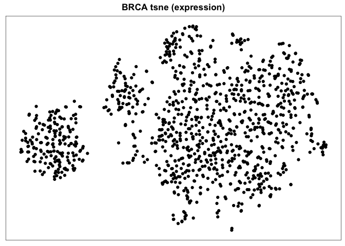

<!-- README.md is generated from README.Rmd. Please edit that file -->

# express

<!-- badges: start -->

[](https://lifecycle.r-lib.org/articles/stages.html#experimental)
[](https://CRAN.R-project.org/package=express)
<!-- badges: end -->

Warning: this repo is in very early development and not yet ready for
use yet.

The goal of express is to simplify exploration of tabular, gene-level
expression datasets.

To analyse your own data, you need a data.frame with 3 columns

1.  *sample*: a sample identifier
2.  *gene*: a gene identifier
3.  *expression*: a quantitative value representing expression of that
    has been normalised so is comparable across samples (e.g. TPM).

## Installation

You can install the development version of express like so:

``` r
# install.packages('remotes')
remotes::install_github('selkamand/express')
```

## Quick Start

``` r
library(express)

path_example <- system.file("example.tsv" ,package = "express")
df_expression <- read_expression_table(path_example)


express_gene_distribution(
  data = df_expression, 
  genes = "TP53", 
  sample_metadata = df_sample_metadata, 
  colour_by = "Disease"
)

express_pathway_distribution(
  data = df_expression, 
  pathways = list("pathway_name" = c("gene1", "gene2", "gene3"))
  sample_metadata = df_sample_metadata, 
  colour_by = "Disease"
)


express_sample_relatedness(
  data = df_expression, 
  method = "TSNE",
  gene_selector = "most_variable",
  sample_metadata = df_sample_metadata, 
  colour_by = "Disease"
)
```

## Accessing Precomputed Public Analyses

express can also visualise the results from precomputed analyses hosted
on GitHub.

For example to see a t-SNE of TCGA BRCA

``` r
library(express)
express_precomputed("BRCA", datatype = "expression")
```



To see all precomputed datasets available

``` r
express_available_datasets()
#>    name method    datatype
#> 1   GBM   tsne  expression
#> 2   ACC   tsne  expression
#> 3  BLCA   tsne  expression
#> 4  BRCA   tsne  expression
#> 5  CESC   tsne  expression
#> 6  CHOL   tsne  expression
#> 7  COAD   tsne  expression
#> 8  DLBC   tsne  expression
#> 9  ESCA   tsne  expression
#> 10 HNSC   tsne  expression
#> 11 KICH   tsne  expression
#> 12 KIRC   tsne  expression
#> 13 KIRP   tsne  expression
#> 14 LAML   tsne  expression
#> 15  LGG   tsne  expression
#> 16 LIHC   tsne  expression
#> 17 LUAD   tsne  expression
#> 18 LUSC   tsne  expression
#> 19 MESO   tsne  expression
#> 20   OV   tsne  expression
#> 21 PAAD   tsne  expression
#> 22 PCPG   tsne  expression
#> 23 PRAD   tsne  expression
#> 24 READ   tsne  expression
#> 25 SARC   tsne  expression
#> 26 SKCM   tsne  expression
#> 27 STAD   tsne  expression
#> 28 TGCT   tsne  expression
#> 29 THCA   tsne  expression
#> 30 THYM   tsne  expression
#> 31 UCEC   tsne  expression
#> 32  UCS   tsne  expression
#> 33  UVM   tsne  expression
#> 34 BRCA   umap methylation
#>                                                description
#> 1    mRNA expression t-SNE from the pancanatlas GBM cohort
#> 2    mRNA expression t-SNE from the pancanatlas ACC cohort
#> 3   mRNA expression t-SNE from the pancanatlas BLCA cohort
#> 4   mRNA expression t-SNE from the pancanatlas BRCA cohort
#> 5   mRNA expression t-SNE from the pancanatlas CESC cohort
#> 6   mRNA expression t-SNE from the pancanatlas CHOL cohort
#> 7   mRNA expression t-SNE from the pancanatlas COAD cohort
#> 8   mRNA expression t-SNE from the pancanatlas DLBC cohort
#> 9   mRNA expression t-SNE from the pancanatlas ESCA cohort
#> 10  mRNA expression t-SNE from the pancanatlas HNSC cohort
#> 11  mRNA expression t-SNE from the pancanatlas KICH cohort
#> 12  mRNA expression t-SNE from the pancanatlas KIRC cohort
#> 13  mRNA expression t-SNE from the pancanatlas KIRP cohort
#> 14  mRNA expression t-SNE from the pancanatlas LAML cohort
#> 15   mRNA expression t-SNE from the pancanatlas LGG cohort
#> 16  mRNA expression t-SNE from the pancanatlas LIHC cohort
#> 17  mRNA expression t-SNE from the pancanatlas LUAD cohort
#> 18  mRNA expression t-SNE from the pancanatlas LUSC cohort
#> 19  mRNA expression t-SNE from the pancanatlas MESO cohort
#> 20    mRNA expression t-SNE from the pancanatlas OV cohort
#> 21  mRNA expression t-SNE from the pancanatlas PAAD cohort
#> 22  mRNA expression t-SNE from the pancanatlas PCPG cohort
#> 23  mRNA expression t-SNE from the pancanatlas PRAD cohort
#> 24  mRNA expression t-SNE from the pancanatlas READ cohort
#> 25  mRNA expression t-SNE from the pancanatlas SARC cohort
#> 26  mRNA expression t-SNE from the pancanatlas SKCM cohort
#> 27  mRNA expression t-SNE from the pancanatlas STAD cohort
#> 28  mRNA expression t-SNE from the pancanatlas TGCT cohort
#> 29  mRNA expression t-SNE from the pancanatlas THCA cohort
#> 30  mRNA expression t-SNE from the pancanatlas THYM cohort
#> 31  mRNA expression t-SNE from the pancanatlas UCEC cohort
#> 32   mRNA expression t-SNE from the pancanatlas UCS cohort
#> 33   mRNA expression t-SNE from the pancanatlas UVM cohort
#> 34 450K methylation array umap from pan-cancer BRCA cohort
```
